[October 6, 2016](https://mrickert.com/coreir/)

Originally published at https://mrickert.com/coreir/, lots of images broken so mirroring here for posterity.

# Reversing iLap, hacking IR protocols, and the creation of CoreIR

My adventure into IR protocols, arduino hardware, and C++ all started when I found out that iLap was selling a small device. This small device, a $40 ‘timing gate transponder’ in essence quickly repeatedly sent a 7 digit number out of an infrared LED to a receiver at the finish line to track how fast drone pilots flew around a race track. “This looks easy enough, I’ll just build my own!” I thought to myself… not knowing what kind of rabbit hole that would lead me down, the rest of this post is dedicated to that journey, to create the ideal homebrew IR transponder for drone racing.

Ok, so I had a receiver system, a single transponder, aaaand that was about it at the onset. First, visually, the boards chip pinout needed to be ID’d, which wasn’t that rough as only about 1/3 of the main processing chips pins were in use according to the traces on the board.

[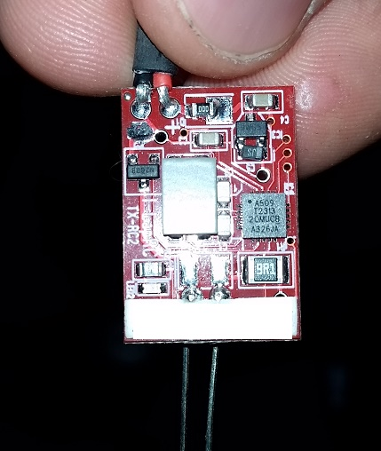](coreir_images/20151213_232517.jpg)

Following the traces, I slowly mapped out each of the pins and their use on the transponder board, seen below:

[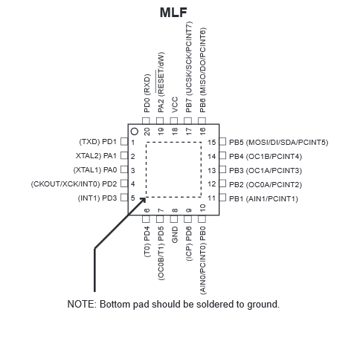](coreir_images/hackingtransponder2.png)
[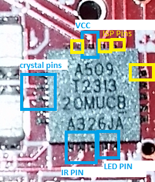](coreir_images/hackingtransponder5.png)

This knowledge wasn’t very helpful on its own though, as it told me nothing about how fast the chip sent the 7 digit code, in what pattern, or any of the other myriad of details needed for IR communication. Flipping the board over, I found a somewhat familiar sight:

[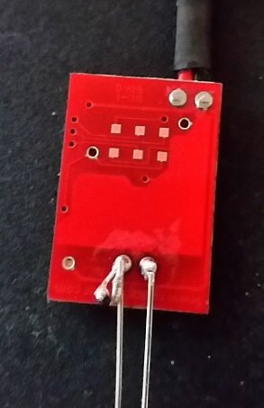](coreir_images/20151213_235752.jpg)

Those sure look a lot like ISP headers! Sure enough, I was able to follow the traces around the board and map each of the exposed pads, which matched exactly with a standard isp header pinout:

[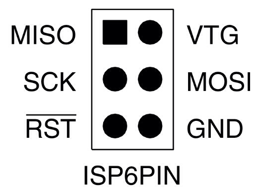](coreir_images/hackingtransponder3.jpg)[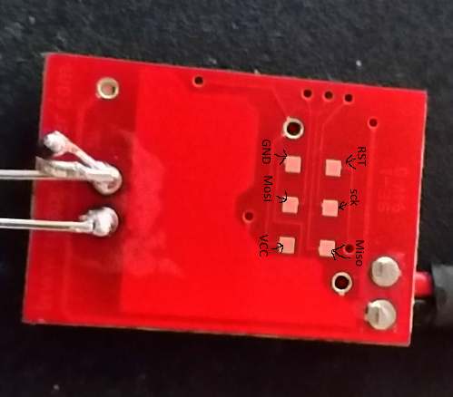](coreir_images/hackingtransponderpinout.png)

With a bit of careful soldering, I connected up a isp programmer and attempted to pull something, anything of use from the chip… but no such luck. If only I had known then just how difficult this board was made to be compatible with I might have stopped at this step, but I trudged on…

[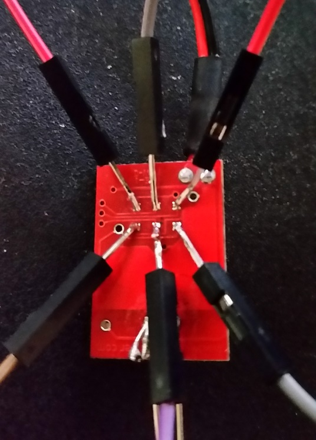](coreir_images/20151214_001534.jpg)
[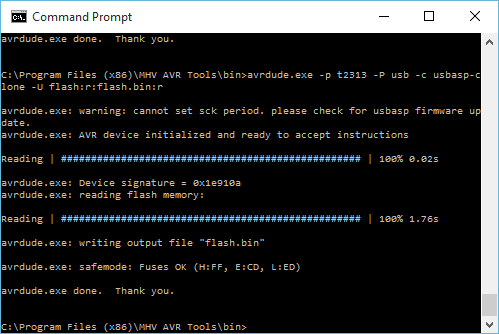](coreir_images/hackingtransponder4.png)

‘If I cant pull code from the board, maybe I can just read the resulting signal from a receiving IR chip and arduino’ I thought to myself, and set out to do just that, the results below show a normal readout from the receiver, complete jibberish. I spent far longer than i would have liked trying to find any kind of pattern or hidden information in the received data but with no luck, any pattern I had thought existed wouldn’t pass a test sending it back out to a real receiver.

```
6A19A4D1
Unknown encoding: 6A19A4D1 (32 bits)
Raw (8): 600 -400 500 -4950 450 -400 350
4DCF0F66
Unknown encoding: 4DCF0F66 (32 bits)
Raw (10): 850 -200 300 -3200 450 -250 550 -100 100
49B0F625
Unknown encoding: 49B0F625 (32 bits)
Raw (6): 450 -100 200 -100 250
4AB0F7B7
Unknown encoding: 4AB0F7B7 (32 bits)
Raw (6): 1300 -4350 650 -450 400
1052D9F8
Unknown encoding: 1052D9F8 (32 bits)
Raw (14): 650 -300 200 -4650 900 -150 150 -200 150 -2900 800 -150 350
2021D06
Unknown encoding: 2021D06 (32 bits)
Raw (10): 400 -150 150 -50 600 -3800 700 -300 450
4AB0F7B7
Unknown encoding: 4AB0F7B7 (32 bits)
Raw (6): 850 -200 250 -150 50
```

In a desperate attempt to find a pattern, I attached a basic oscilloscope to the IR led on the transponder board. Well, at least it wasn’t complete jibberish!

[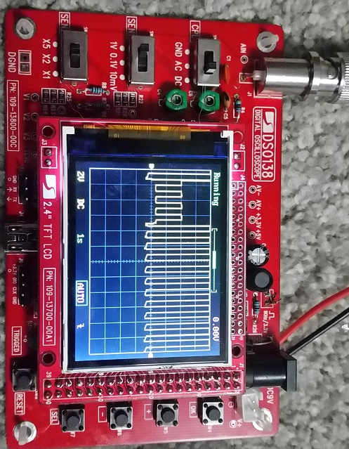](coreir_images/20160116_012838.jpg)

Inspired by the (albeit very little) progress made from the oscilloscope I converted a spare arduino into a makeshift logic sniffer, and attached it to the same IR led pin. Success! A real pattern started to show itself. This was no where near a cut and paste job to making my own transponder, but it sure was a lot better than guessing at completely malformed code and bad IR receiver readings…

[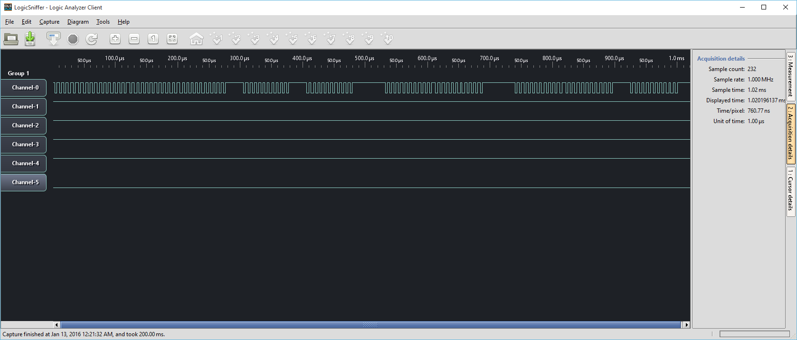](coreir_images/logic-sniffing-transponder.png)

Learning the very quickly apparent limitations of an arduino logic sniffer, I went and purchased the real deal, meet the DSLogic Pro. The DSLogic Pro was capable not only of much, much higher speeds than the arduino, it also included a much more newbie friendly user interface as well as the key to what I needed, more internal memory to store longer recordings.

[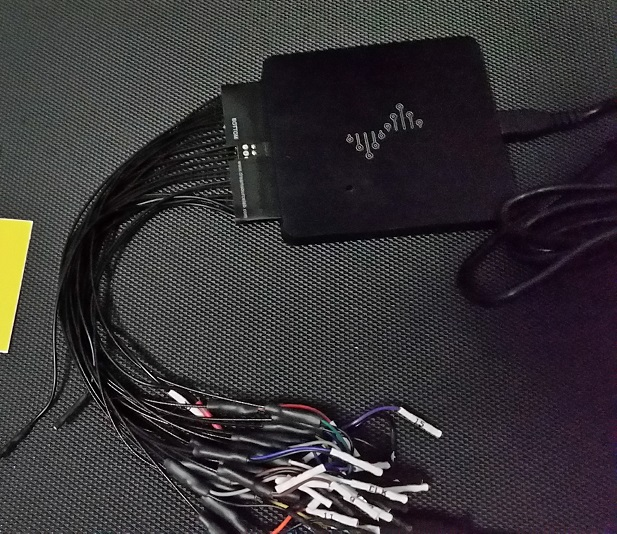](coreir_images/20160121_192031.jpg)

Wiring up the DSLogic Pro to both the genuine transponder, and my arduino designed one, I plugged away at trying to make my IR led blink in the exact pattern as the original. What also assisted with this in the beginning, I attached a third lead onto the IR receiver itself, and listened to see if the frequency of the IR signal I was putting out was being picked up properly:

[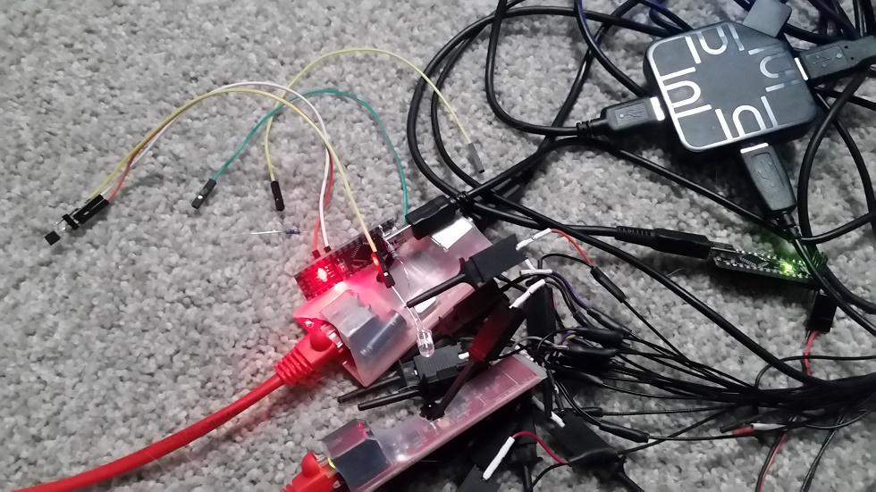](coreir_images/20160127_214354.jpg)

Here is a screenshot style view of what the above looked like. The orange and brown represent the receiver (brown) and original transponder (orange), my arduino version was in red. By using the IRremote library for arduino, and continuously adjusting the on/off timings sent to the arduino led, I was able to come tantalizingly close to matching the original signal blip for blip.

[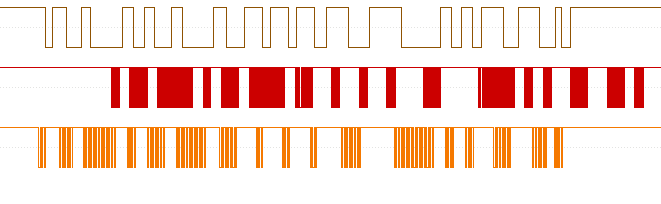](coreir_images/Pasted-image-at-2016_01_27-10_05-PM.png)

Below is an example snippet of the first iteration of my transponder code, stupid simple and just constant editing of the ‘rawdata’ field and ‘khz’ field. Each of the raw data numbers had to be detected by hand, by reading the IR pulse, looking at the above logic analyzer readout, and then tacking it onto the array in a close guesstimate of what the real timing was (give or take a few microseconds for the arduino to actually turn off and on the led).
```
#include <IRremote.h>

IRsend irsend;
  int khz = 15; // 38kHz carrier frequency for the NEC protocol
  unsigned int rawData\[33\] = {22, 22, 48, 22, 88, 22, 22, 22, 48, 22, 88, 22, 48, 48, 22, 48, 22, 48, 22, 68, 48, 93, 93, 22, 22, 22, 22, 53, 48, 48, 48, 22, 22};

void setup()
{
}

void loop() {
  irsend.sendRaw(rawData, 33, khz); //Note the approach used to automatically calculate the size of the array.
  delayMicroseconds(480);
```
Many (many) hours later, my hard coded on off timings produced a result! Each ‘flicker’ of blue below was a successful read of my homebrew transponder. At first I would maybe get 1 read for every 50 or 60 sends, but over time, and by normalizing the on/off timings of the IR led, i was able to get a good 2/3 of my pulses successfully read.

[coreir\_images/20160127\_220015.mp4](coreir_images/20160127_220015.mp4)

I also tried to get the above result using smaller chips, attiny85’s, but that proved unsuccessful as the existing attiny85 boards on market didn’t include an external resonator (crystal) to keep exact microsecond timings for the on/off pulses. I also (very naively) thought that my arduino replica could just have the IR led attached direct to the pin I wanted to use, oh how that would have been wonderful if it were true. But alas, some discreet components were also required to flash the led properly (and bright enough).

[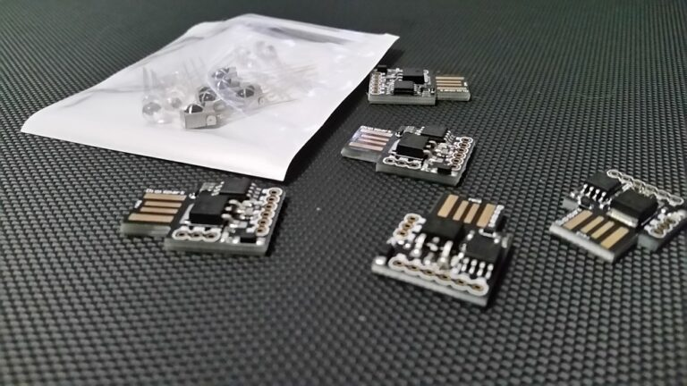](coreir_images/20151119_160228.jpg)
[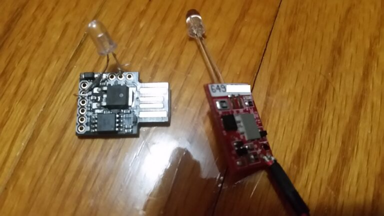](coreir_images/20151124_010930.jpg)

Below is a picture of the absolute bare minimum parts needed to properly drive the IR led for a transponder, a NPN transistor… This setup surpisingly worked, and quite well, but I later added a resistor to help keep things sane.

[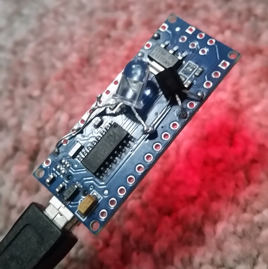](coreir_images/20160127_225320.jpg)

Several transponders later, I had created a quasi-database of successful raw on-off timings, allowing me to quickly flip a transponder between several 7 digit codes based on the reading of the real transponders, below is an example of that code:

```
//\*\*\*\*CONFIGURATION OPTIONS\*\*\*\*
//change transponder ID # by setting a different transponder number
//available values are 1-6

#define transponder2

//\*\*\*\*CONFIGURATION END\*\*\*\*

//setup for the transponder IR signal
#include <IRremote.h>
IRsend irsend;
int khz = 15;

//transponder defines
#ifdef transponder1
    //raw on/off for code 
    unsigned int rawData\[33\] = {48, 22, 22, 22, 98, 22, 68, 22, 48, 48, 22, 22, 48, 48, 48, 98, 48, 22, 22, 48, 48, 48, 22, 22, 22, 178, 22, 22, 22, 68, 22, 22, 22};
    int size = 33;
#endif
#ifdef transponder2 
    //
    unsigned int rawData\[35\] = {22, 22, 22, 48, 98, 22, 22, 22, 22, 22, 48, 48, 22, 22, 22, 68, 22, 68, 22, 22, 48, 68, 22, 48, 22, 22, 22, 48, 22, 22, 68, 48, 48, 103, 83};
    int size = 35;
#endif

void loop() {
  irsend.sendRaw(rawData, size, khz);
  delayMicroseconds(2600);
}
```
The hardware also progressed, and slowly evolved into a more complete build, first with the led coming out the side…

[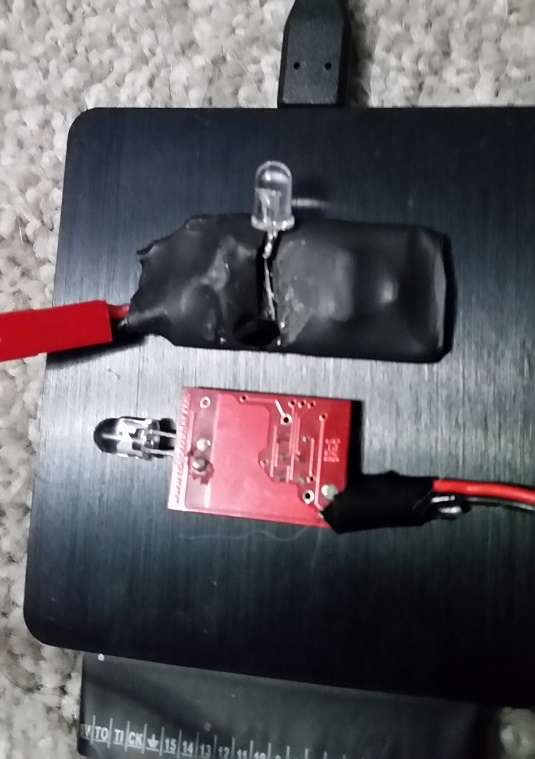](coreir_images/20160128_185738.jpg)

But that proved to be near impossible to cleanly attach to a prebuilt drone… I then tried copying the design of the original led…

[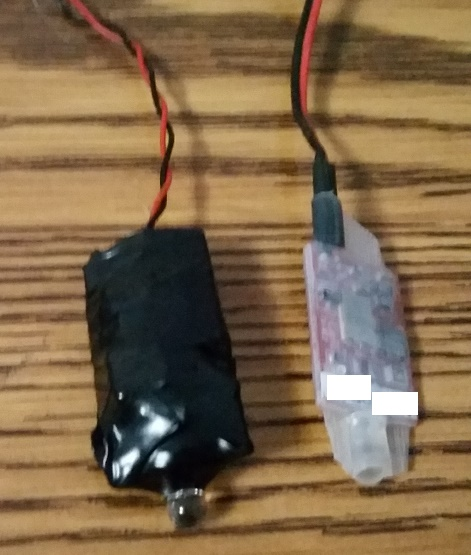](coreir_images/20160503_234325.jpg)

But that too, proved unnecessarily difficult to properly mount. Yet I continued on with that hardware design for several more iterations, later adding a 5v step down and a 4s balance lead connetor as well…

[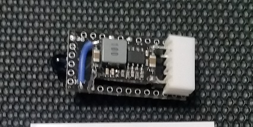](coreir_images/20160512_223320.jpg)[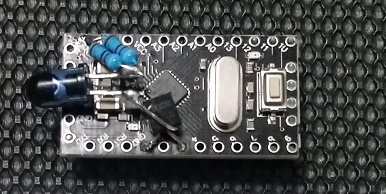](coreir_images/20160512_223525.jpg)

Here you can see what I mean about mount position, note the led ends up facing directly forward, which is possibly the least ideal position when a drone flies through a gate that is on either side of it:

[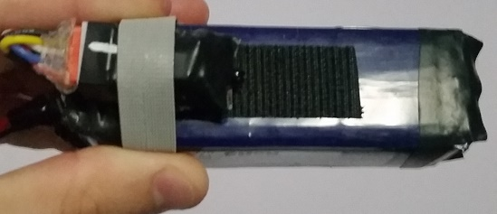](coreir_images/20160512_231622.jpg)

It wasn’t until a fellow pilot showed me their makeshift system for keeping the transponder secured that my design made a proper change. Here’s his design, which worked surprisingly well to quickly add, and remove, from quads based on the battery strap.

[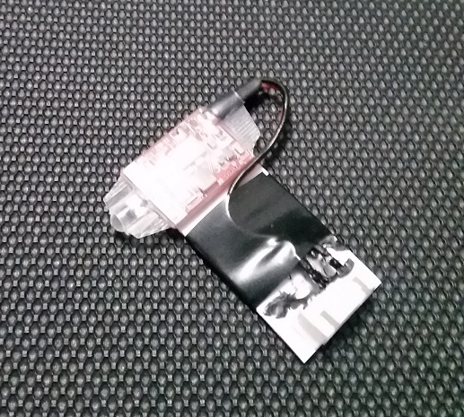](coreir_images/20160509_225627.jpg)

I then slowly tried to make my design fit that style, long and flat with the led shooting out the side…

[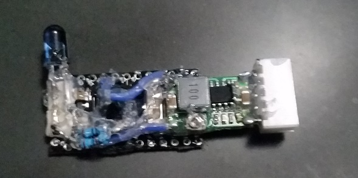](coreir_images/20160513_210750-1.jpg)

[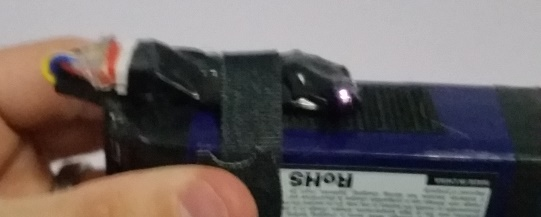](coreir_images/20160513_210208.jpg)[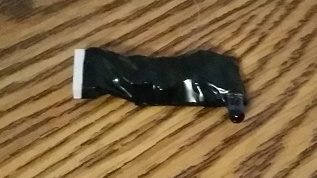](coreir_images/20160513_210254.jpg)

It worked well enough that I felt confident in doing some real world testing, I first set up a makeshift gate in my yard and flew past it with my custom transponder several times…

[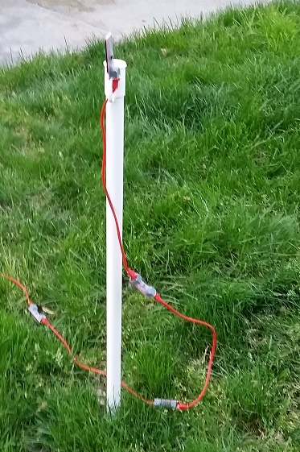](coreir_images/20160508_195215.jpg)[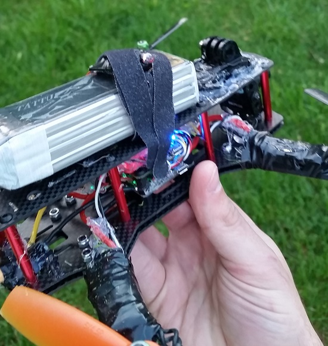](coreir_images/20160508_195229.jpg)

Look at that! It reads even in broad daylight! Not shabby for off the shelf parts and a bit of arduino code…

[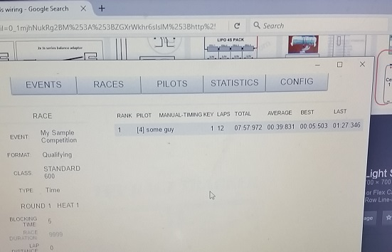](coreir_images/20160508_195206.jpg)

Taking everything I learned into account, I made up ten of my custom transponders and sent them on their way to a local race for proper testing, which also yielded great results. This also meant that one pilot could keep the same ID number no matter how many transponders he owned, something that was simply not possible with the original transponders which each had their own unique ID…

[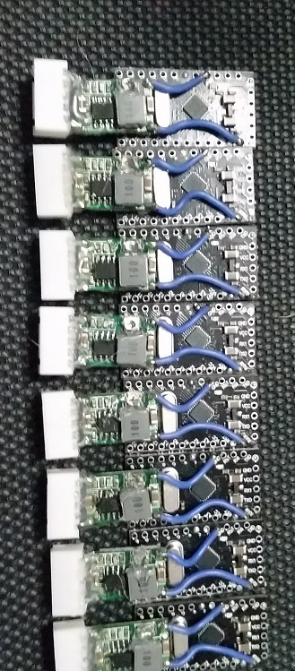](coreir_images/20160513_231013.jpg)

With the success at the local race, I tried to once again improve on the design, attempting to use a smattering of prepackaged arduino boards to find the best fit…

[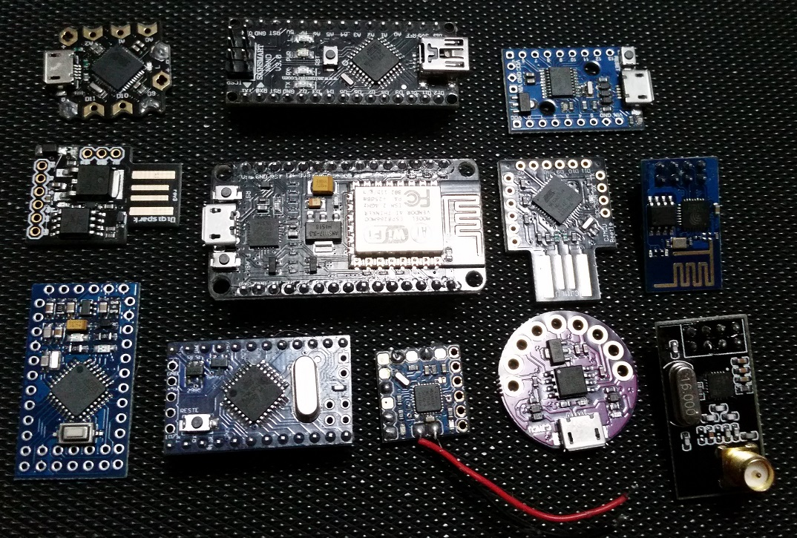](coreir_images/IMG_20160817_215558.jpg)

I eventually settled on the ‘arduino pro micro’, not only for its small size and large feature set, but for its direct microusb connection and atmega chip with external crystal. At the same time I added a second IR led onto the other side of the board, allowing a pilot to mount the transponder in any way they saw fit while still having a great chance of being read by the receiver at the finish line.

[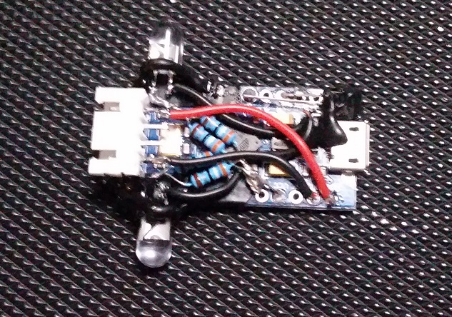](coreir_images/IMG_20160819_225316.jpg)

I also played with the location of the leds to ensure the best fit for the battery strap, as to not have them get in the way while still providing ample security to the battery (or drone itself).

[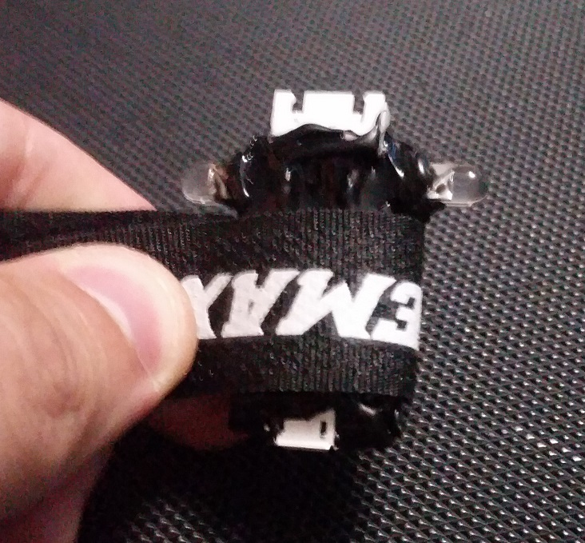](coreir_images/IMG_20160819_231615.jpg)

One piece of the puzzle was still missing though, I could only clone existing transponders, not create my own 7 digit codes. At about this time a post had been floating around from Dr. Gareth Owenson on how [he managed to crack the iLap protocol](http://blog.owenson.me/reversing-ilap-race-transponders/). While I was able to grasp the concept, and follow in theory how he did it, I was having difficulty turning his findings into real world arduino code. It wasn’t until an anonymous tipster fired over some code to me one day that things took a positive turn on that front. They claimed their code could generate new 7 digit valid iLap codes on the fly, using the instructions provided by Owenson, and sure enough it worked! (example below)

```
// split ID into digits
byte tdigit7 = tcode % 10;
byte tdigit6 = (tcode / 10) % 10;
byte tdigit5 = (tcode / 100) % 10;
byte tdigit4 = (tcode / 1000) % 10;
byte tdigit3 = (tcode / 10000) % 10;
byte tdigit2 = (tcode / 100000) % 10;
byte tdigit1 = (tcode / 1000000) % 10;

// fill in code values
byte fullcode\[6\];
fullcode\[0\] = 0xf0 + tdigit1;
fullcode\[1\] = 0x00;
fullcode\[2\] = (tdigit2 << 4) + tdigit3;
fullcode\[3\] = (tdigit4 << 4) + tdigit5;
fullcode\[4\] = (tdigit6 << 4) + tdigit7;
fullcode\[5\] = 0x00;
```

He had taken my open sourced work on the IR protocol side of things, as well as hardware, and spliced in his encoding work to make a complete system. With that in place, the code was optimized and simplified, all the while being posted up to [my github account for all to view.](https://github.com/RaceFPV/CoreIR)

I later added support for a desktop client to further simplify the transponder ID setting process, as well as easier flashing of new transponders in electron (node) and using the avr-girl package. As of this post progress on the CoreIR transponder, and the desktop app, continues…. I continue to tweak and adjust timings, playing with different frequencies and numbers to get the ideal signal out of my homebrew transponders, but I hope to help bring light to the start of that code, and project, through this blog post. I also hope that this blog post will inspire others, with minimal hardware and troubleshooting knowledge, to dive head first into a project and fight until they achieve success. As for the code and hardware designs, they will always remain free and OSS for all to enjoy and contribute to, as that’s what helped make this project a true triumph and joy to work on.

[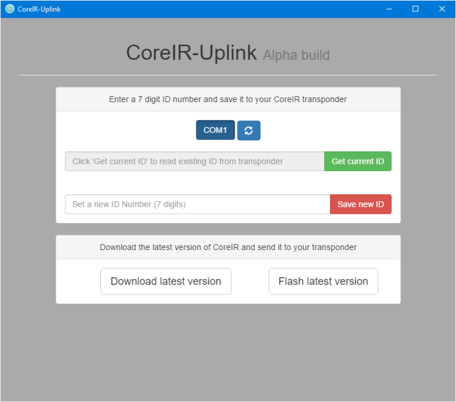](coreir_images/coreirscreenshot.png)

A follow up post is coming soon with step by step instructions on how to build your own CoreIR transponder, stay tuned!

### Post navigation

[← Quick Dell n1524p thermal testing](https://mrickert.com/quick-dell-n1524p-thermal-testing/)

[Building your own CoreIR transponder →](https://mrickert.com/building-your-own-coreir-transponder/)

## 3 comments for “Reversing iLap, hacking IR protocols, and the creation of CoreIR”

### Leave a Reply [Cancel reply](/coreir/#respond)

You must be [logged in](https://mrickert.com/wp-login.php?redirect_to=http%3A%2F%2Fmrickert.com%2Fcoreir%2F) to post a comment.

Copyright © 2024 [k3s.live](https://mrickert.com). All Rights Reserved. The Ward Theme by [bavotasan.com](https://themes.bavotasan.com/themes/farben-wordpress-theme/).